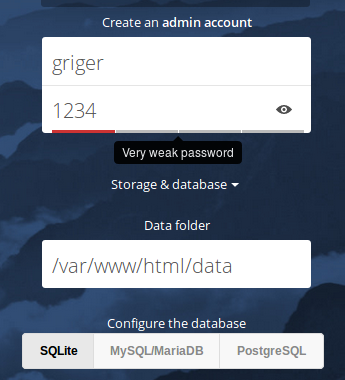
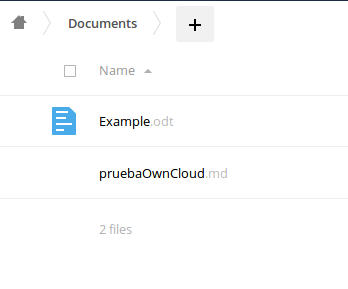
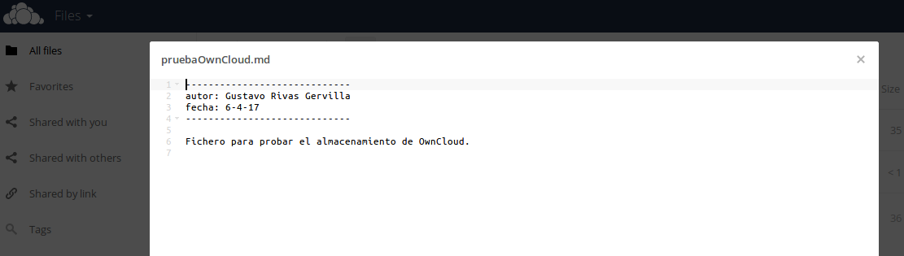
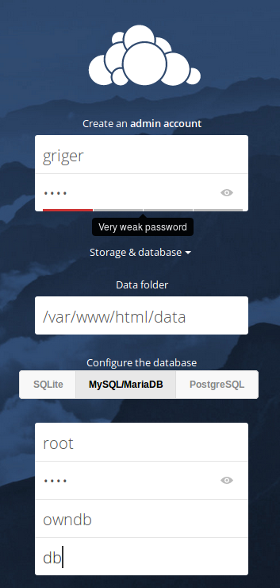

# Cloud Computing: Servicios y aplicaciones.
# P2: Uso de contenedores Docker
# Gustavo Rivas Gervilla. gustavofox92@correo.ugr.es

## Enunciado:

**El objetivo de esta práctica es familiarizarse con el uso de una plataforma PaaS y desarrollar habilidades de despligue de contenedores y configurar aplicaciones sencillas en los mismo.**

**Para ello lo que se hará será desarrollar una arquitectura similar a la desarrollada en la primera práctica, en esta ocasión empleando contenedores en lugar de máquina virtuales como las unidades en las que desplegaremos nuestra aplicación web. Así se creará un contenedor Docker que actuará como servidor web y otro que será el servidor de base de datos, ambos conectados entre sí.**

**Complementariamente se realizarán otras actividades como la del despliegue de un contenedor con el servicio OwnCloud.**

## Primeros pasos

Lo primero que hago es conectarme al servidor con `ssh mcc75570417@hadoop.ugr.es` y ejecutar la orden `docker run hello-world` comprobando así que la plataforma está correctamente configurada para el despliegue de los contenedores.

El siguiente paso es visitar el [enlace](https://github.com/manuparra/MasterDegreeCC_Practice/blob/master/README.md#on-hadoop-cluster-this-is-the-account-port-assignment-for-docker-containers) que se facilita en el [guión](https://github.com/manuparra/MasterDegreeCC_Practice/blob/master/starting_docker.md) de la práctica para ver los puertos que tenemos disponibles: 14085-14089. Estos serán los puertos a través de los cuales podremos exponer al exterior puertos de los distintos contenedores que despleguemos. Una vez tenemos esto claro podemos pasar a realizar el tutorial que se facilita en el guión de práctica a fin de hacernos con el manejo de la plataforma desplegando nuestro primer contenedor Docker en ella.

## Tutorial para configurar un servidor nginx en un contenedor Docker:

Vamos a crear un contenedor con una imagen de nginx precargada, previamente ya he comprobado que existe tal imagen (`docker images`) con lo que no necesito descargarla, `docker run -d -p 14085:80 --name testnginxGriger nginx`. Una vez lo hemos creado comprobamos que no podemos crear un nuevo contenedor (con un nombre distinto) usando el mismo puero que hemos usado para exponer el puerto 80 del contenedor anterior, obtenemos el siguiente error:

```bash
Error response from daemon: Cannot start container bdfc61e5300011974a446323d024c1c2cbbbdf17867282b895e2d9bf5db7ceae: Bind for 0.0.0.0:14085 failed: port is already allocated
```

Así confirmamos que no podemos emplear el mismo puerto más de una vez. Finalmente para probar la conexión lo que hacemos es ir a la dirección http://hadoop.ugr.es:14085/. Podemos editar la página de inicio del contenedor: accedemos al contenedor que acabamos de crear `docker exec -i -t testnginxGriger /bin/bash` y modificamos, con vim por ejemplo, el archivo */usr/share/nginx/html/index.html*.

Una vez hemos creado nuestro primer contenedor en la plataforma de prácticas pasamos a crear la arquitectura de contenedores necesaria para desplegar nuestra aplicación web.

## Configurando el contenedor para la base de datos.

Vamos a crear el contenedor de MariaDB sin exponer el puerto por defecto ya que realmente no queremos acceder a él desde fuera. Con lo cual la instrucción que vamos a emplear para crear el contenedor es la siguiente: `docker run -d --name servidormariadb_griger -e "MYSQL_ROOT_PASSWORD=1234" mariadb`, en esta ocasión no hemos hecho antes el pull de imagen docker a utilizar, con lo cual cuando ejectuamos esta orden, ya que la imagen no está en el sistema, la descarga automáticamente. Mencionar que en caso de que no especifiquemos la variable de entorno que define la contraseña para el usuario root del servidor entonces el contenedor saldrá con un estado no nulo, es decir, se cerrará con un error. Con esto ya tendremos preparado nuestro servidor de base de datos.

## Configurando el contenedor para el servidor web

Ahora vamos a crear el contenedor que actuará como servidor web, el contenedor que vamos a crear cuenta con PHP5, SSL y Apache, con lo que además de configurar la otra mitad de nuestra arquitectura de despliegue, también realizamos el primer ejercicio de esta práctica.

Vamos a descargar una [imagen](https://hub.docker.com/r/piuma/centos7-apache-php/) que nos proporciona un CentOS 7 con Apache 2.4 y PHP 5.4, para descargar esta imagen emplearemos el comando `docker pull piuma/centos7-apache-php`.

He creado el contenedor con la siguiente orden: `docker run -d -p 14087:80 -p 14088:443 --name servidorWeb_griger --link servidormariadb_griger:db piuma/centos7-apache-php`. Anteriormente creamos el contenedor sin exponer el puerto 443 con lo que obteníamos el siguiente error: *Post http:///var/run/docker.sock/v1.19/containers/create?name=servidorWeb_griger: dial unix /var/run/docker.sock: no such file or directory. Are you trying to connect to a TLS-enabled daemon without TLS?*. Esto probablemente se deba a que este servidor proporciona SSL, que será el protocolo sobre el que se configure el protocolo HTTPS, por esto exponemos este puerto.

En la instrucción anterior hemos enlazado este contenedor con el de base de datos anteriormente creado, así especificamos el parámetro `--link` donde damos el nombre del contenedor a enlazar, dos puntos y el alias que le damos a ese contenedor.

Para comprobar que el contenedor se ha creado correctamente y visitar la página principal del servidor Apache visitamos la dirección http://hadoop.ugr.es:14087/.

Dentro del servidor de base de datos usamos el comando de consola `php -m` para comprobar que entre los modulos de PHP que tiene instalado el contenedor ya está tanto **mysql** (que es el módulo que se utilizaremos en nuestra aplicación web) como **mysqli** que es el nuevo módulo para MySQL. Con lo que no necesitamos realizar ninguna instalación adicionalo sobre la imagen de Docker que hemos descargado.

Finalmente comprobamos que podemos acceder al servidor mysql poniendo el siguiente código en la página */var/www/html/index.php*:

```php
<?php
$enlace =  mysql_connect('db', 'root', '1234');
if (!$enlace) {
    die('No pudo conectarse: ' . mysql_error());
}
echo 'Conectado satisfactoriamente';
mysql_close($enlace);
?>
```
Como podemos ver usamos como host-name el alias que le hemos dado al otro contenedor al crear el link, no podemos poner localhost ya que en ese caso las conexiones se intentarían hacer dentro del propio contenedor, el cual no dispone siquiera de un servidor MariaDB.

## Desplegando la app web

Para desplegar nuestra apliacación web seguimos los siguientes pasos:

* Arrancamos los dos contenedores, el de base de datos y el web, si no están operativos en ese momento con `docker start nombreContenedor`.
* Accedemos al servidor de base de datos con `docker exec -i -t servidormariadb_griger /bin/bash`.
* Entramos dentro del servidor SQL y ejecutamos las distintas instrucciones de creación de la BD que ya hicimos en la práctica anterior. Es simplemente introducir 3 bloques de instrucciones. Podríamos descargar el script de creación de la base de datos proporcionado en la memoria si se desea.
* Salimos de este contenedor y nos vamos al servidor web, comprobando que seguimos podiendo acceder al servidor de BD.
* Instalamos git en este contenedor para poder descargar el repositorio con la app web desarrollada en la anterior práctica: `yum -y install git`. Descargamos el repositorio dentro del directorio **/var/www/html**.
* Cambiamos las órdenes mysql-connect en los archivos *show.php* y *nuevoCampeon.php* para conectar al servidor MariaDB.
* Accedemos a la aplicación en la dirección http://hadoop.ugr.es:14087/CC-SA/appP1/ .
* Se comprueba que se listan los campeones de la base de datos y que se pueden insertar nuevos.

### Descripción de la app web

Esta aplicación va a ser una aplicación muy simple para consultar e insertar información en una base de datos sobre los personajes del juego de ordenador [League of Legends](http://euw.leagueoflegends.com/es). Entonces lo que haremos en nuestro servidor MySQL será en primer lugar crear la nueva base de datos:

```SQL
CREATE DATABASE IF NOT EXISTS lol;
```

A continuación creamos la tabla que contendrá la información de esta base de datos, en nuestro caso sólo tendremos una tabla, si tuviésemos más no aumentaría la complejidad de la aplicación web, ni por supuesto la de la arquitectura de MV que se ha definir como objetivo de esta asignatura.

```SQL
CREATE TABLE lol.campeon(
	nombre varchar(20) PRIMARY KEY,
	posicionPpal ENUM('TOP', 'JNG', 'MID', 'ADC', 'SUP'),
	rolPpal varchar(15) NOT NULL,
	rolSecundario varchar(15) DEFAULT NULL,
	P varchar(30) NOT NULL,
	Q varchar(30) NOT NULL,
	W varchar(30) NOT NULL,
	E varchar(30) NOT NULL,
	R varchar(30) NOT NULL);
```

Y ahora insertamos algunas instancias en esta tabla para tener algún contenido que mostrar de inicio, luego ya será el usuario el que a través de la aplicación web alojada en nuestro servidor web inserte nueva información en esta BD:

```SQL
INSERT INTO lol.campeon VALUES('Aatrox', 'TOP', 'Luchador', 'Tanque', 
'Pozo sangriento', 'Vuelo oscuro', 
'Sed de sagre/Precio sangriento', 'Espadas del tormento', 'Masacre');
INSERT INTO lol.campeon VALUES('Fizz', 'MID', 'Asesino', 'Luchador', 
'Luchador veloz', 'Golpe travierizo', 'Tridente piedramar', 
'Juguetón/Bromista', 'Carnada para tiburones');
INSERT INTO lol.campeon VALUES('Nautilus', 'TOP', 'Tanque', 'Luchador', 
'Golpe maestro', 'Línea de dragado', 'Ira del titán', 'Aguas revueltas', 
'Carga de las profundidades');
```
A continuación diseñamos una aplicación sencilla que consta de un menú principal, un página donde se puede consultar el contenido de la table permitiéndonos filtrar su contenido por la posición en la que se juega el campeón y una página con un formulario para insertar un nuevo campeón en la BD. El código de esta aplicación se encuentra en el [repositorio de GitHub](https://github.com/Griger/CC-SA/tree/master/appP1) que he creado para la asignatura.

### Uso de la aplicación

Una vez que hayamos accedido a la página principal de la aplicación, que en nuestro caso se encuentra en la dirección http://docker.ugr.es:15094/CC-SA/appP1/ debido a la estructura de directorios que tenemos en **/var/www/html**, podremos acceder tanto a la tabla de campeones almacenados en la BD desde el botón *Ver campeones* o insertar un nuevo campeón desde el botón *Nuevo campeón*.

En la pantalla con la tabla de campeones podemos filtrar los campeones por su posición principal dentro del juego a través del menú desplegable que se facilita al lado del botón *Filtrar* que es el que pulsaremos para filtrar los resultados.

Por otro lado en la para insertar un nuevo campeón tendremos que rellenar todos los campos asegurándonos de no repetir el nombre de un campeón ya creado, ya que como hemos visto anteriormente el nombre es lo que usamos como clave de la tabla.

## Sobre la duplicación de contenedores

Es claro, y se ha comprobado a lo largo de las prácticas que podemos tener varios contenedores con el mismo servicio desplegado. Podemos crear una imagen a partir de un contenedor y así replicar exactamente el mismo varias veces.

En cuanto al balanceo de carga podemos hacerlo por ejemplo, como se propone en un [hilo](http://stackoverflow.com/questions/28315706/how-to-load-balance-containers), con un servidor nginx al cuál le especificamos la dirección de los distintos contenedores junto con el puerto.

Concretamente podemos seguir un [tutorial](http://superuser.openstack.org/articles/run-load-balanced-service-docker-containers-openstack/) el que se nos explica cómo tener varios contenedore con el mismo servicio (en este caso el hello-world de Docker) y otro contenedor con nginx actuando como balanceador de carga.

Pensemos ahora en cómo podemos realizar una replicación de nuestro contenedor de bases de datos, nos gustaría tener, igual que antes, la seguridad de que si uno de los contenedores cae entonces podamos conectarnos a otro. Una primera medida de seguridad sería [disponer de un contenedor que actúe como backup](https://blog.confirm.ch/backup-mysql-mariadb-docker-container/) de la base de datos, permitiéndonos en cualquier momento restaurar el estado de nuestra base de datos.

Ahora bien, lo que nosotros buscamos es tener varios contenedores docker con el mismo contenido, de modo que uno pueda actuar como *sustituto* de otro en caso de ser necesario. Para ello podemos establecer una [replicación maestro-maestro entre los dos contenedores](https://vnextcoder.wordpress.com/2016/09/19/mysql-master-master-replication-setup-on-docker/).

El uso de los distintos contenedores dentro de los servidores web podría realizarse sin más complicación a nivel de aplicación; si cuando intentamos conectar a una base de datos tenemos problemas entonces pasaremos a conectarnos a otra base.

## Configurando contenedor OwnCloud

Creamos el contenedor con la siguiente instrucción `docker run -d --name owncloud_griger -p 14085:80 owncloud:9.1` y vemos que la instalación se ha realizado correctamente visitando la dirección http://hadoop.ugr.es:14085/ donde se muestra la página de inicio de OwnCloud. En esta pantalla creamos la cuenta para el administrador junto con su contraseña (griger - 1234). A continuación se muestra una captura de pantalla con las opciones que hemos elegido en esta pantalla:



Se ha intentado emplear una base de datos MariaDB pero nos daba un fallo de fichero no encontrado, probablemente porque el software necesario para trabajar con MariaDB no está instalado en el contenedor. Con lo cual, y dado que se trata sólo de una prueba de funcionamiento, dejamos la base de datos como SQLite.

Creamos un fichero de prueba en nuestra máquina, no es necesario que lo hagamos dentro del contenedor, elegimos la carpeta Documentos y pulsamos el botón para añadir fichero (**+**), vemos que se carga correctamente el fichero y que se puede abrir en el navegador sin problema:




Dentro del contenedor podemos ver estos documentos en el directorio */var/www/html/data/griger/files/Documents*. Hemos hecho la prueba de crear con el comando `touch` un fichero dentro de dicho directorio, pero no se puede visualizar en el cliente online de OwnCloud, debido a que no ha sido introducido por el usuario de la base de datos que hemos configurado anteriormente.

### Configurando  una base de datos distinta a SQLite (MariaDB)

Ahora vamos a tratar que nuestro contenedor OwnCloud emplee una base de datos distinta a SQLite, en nuestro caso MariaDB. Para ello vamos a reutilizar el contenedor MariaDB que hemos creado anteriormente y vamos a seguir las instrucciones que se dan en la [propia página](https://hub.docker.com/_/owncloud/) de la imagen Docker de OwnCloud. Lo que hacemos es arrancar el contenedor MariaDB con `docker start` y eliminamos el contenedor de OwnCloud que creamos anteriormente.

En la página de la imagen lo que nos dicen es que para usar una base de datos MySQL podemos *linkar* el contenedor OwnCloud con uno MySQL y eso es lo que vamos a hacer con el siguiente comando `docker run -d --name owncloud_griger -p 14085:80 --link servidormariadb_griger:db owncloud:9.1`. Y ahora simplemente configuramos OwnCloud para que haga uso del contenedor MariaDB para almacenar su base de datos:



Señalar, como dice en este [hilo](http://stackoverflow.com/questions/37702595/owncloud-setup-sqlstatehy0001045-access-denied-for-user-owncloudlocalhos), que no la contraseña ha de estar oculta (mediante puntos) para que la finalización de la configuración del contenedor se produzca correctamente, de otro modo nos dará un error de acceso.

## Otros ejercicios

**¿Cual es el puerto de SSL?** Será el puerto del protocolo que se haya configurado de forma segura sobre SSL, así en el caso de HTTPS sería el puerto 443. [Aquí podemos ver una lista](http://stason.org/TULARC/security/ssl-talk/3-4-What-ports-does-SSL-use.html).

**¿Como redigir el puerto a vuestro puerto asingado?** Con la opción -p del comando `run` de docker, puertoAsignado:443. Veremos más ejemplos de uso de esta opción más adelante.

## Enlaces consultados

* [Tutorial para conectar desde un servidor con PHP a uno con un servidor MySQL](http://www.samueledney.com/2016/01/21/trying-out-docker-php-and-mysql/)
* [Otro tutorial donde habla de la misma temática](http://mmenozzi.github.io/2016/01/22/php-web-development-with-docker/)
* [Configurando un servidor MySQL (hay que especificar la contraseña del usuario root al menos)](https://severalnines.com/blog/mysql-docker-containers-understanding-basics)
* [Donde se intuye qué hay que poner en el código PHP para conectar al servidor MariaDB](http://stackoverflow.com/questions/36378615/docker-mysql-cant-connect-to-container)
* [Donde queda claro qué nombre de host hay que usar para conectar al contenedor MariaDB](http://www.newmediacampaigns.com/blog/docker-for-php-developers)

